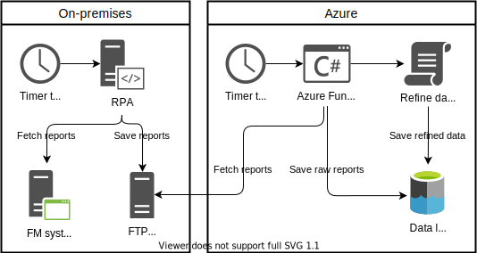

This article describes how to extract reports from a SFTP or FTPS with an Azure App Service, and saves them in a data lake.
<!--more-->

## The infrastructure

Recently we built a robot (RPA) with **Softomotive** [^1] , to extract some excel reports from our facility management system; **Dalux FM**.

The RPA uploads the files to a FTP server. I choose to use SFTP instead of FTPS, because SFTP has a better usability with firewalls. I show how to hook up with both protocols.

In Azure, I have a service app, as a Timer trigger, that looks every hour at the FTP for any new files.

The data gets cleaned up and converted from `xlsx` to `csv`. 

Finally the service app, uploads the files, directly to a data lake in Azure. I could have send them to an event hub, and made a more separated code, but it will do for now.



## Azure Functions timer trigger

I created this Azure Function version V3 ([full version on GitHub](https://github.com/hillerod/Warehouse.Fileup/blob/master/Warehouse.Fileup.Functions/DaluxFMFromFTP/TimerTrigger.cs)):

```csharp
[FunctionName("DaluxFMFromFTP_TimerTrigger")]
public static void Run([TimerTrigger("0 0 * * * *")] TimerInfo myTimer, ILogger log)
{}
```
The TimerTrigger determines how often the trigger should be called: `{second} {minute} {hour} {day} {month} {day-of-week}`. So this will be called every hour.

In `local.settings.json`, I have all my variables and secrets for testing on my computer. To reach it, I write:

```csharp
var config = new ConfigurationBuilder().SetBasePath(Directory.GetCurrentDirectory())
.AddJsonFile("local.settings.json", optional: true, reloadOnChange: true)
.AddEnvironmentVariables().Build();
```
The `AddEnvironmentVariable`, assures that variables defined within Azure, gets transferred.

In `local.settings.json`, I have:
```json
{
  "Values": {
    "FTPConnectionStringDaluxFM": "host=url.com;user=username;pass=password;path=/daluxfm;"
  }
}
```
Instead of having `host, user, password and path` as individual variables, I have gathered them into one connection-string, and then extended ssh.net with a helper. Build it like this ([full version on GitHub](https://github.com/hillerod/Warehouse.Fileup/blob/master/Warehouse.Fileup.Functions/Helpers/FTPClientHelper.cs)):

```csharp
using Renci.SshNet;

namespace Warehouse.Fileup.Functions.Helpers
{
    public class FTPClientHelper : SftpClient
    {
        private static string _path;

        public string Path { get { return _path; } }

        private static string _host;
        public string Host { get { return _host; } }


        public FTPClientHelper(string connectionString) : base(CreateConnectionInfo(connectionString))
        {

        }

        private static ConnectionInfo CreateConnectionInfo(string connectionString)
        {
            var user = "";
            var pass = "";
            int port = 0;
            foreach (var item in connectionString.Split(';'))
            {
                var pair = item.Split('=');
                if (pair.Length == 2)
                {
                    switch (pair[0].ToLower())
                    {
                        case "host": _host = pair[1]; break;
                        case "user": user = pair[1]; break;
                        case "pass": pass = pair[1]; break;
                        case "port": int.TryParse(pair[1], out port); break;
                        case "path": _path = pair[1]; break;
                    }
                }
            }

            if (user != null && pass != null)
                return new ConnectionInfo(_host, user, new PasswordAuthenticationMethod(user, pass));

            return default;
        }
    }
}
```

## SFTP setup

SFTP has a better usability with firewalls, than FTPS.

I call the SFTP, by using the NuGet package [SSH.NET](https://github.com/sshnet/SSH.NET/) with this implementation:

```csharp
using var client = new FTPClientHelper(config["FTPConnectionStringDaluxFM"]);
try
{
    client.Connect();
}
catch (Exception)
{
    log.LogError("Could not connect to FTP.");
    throw;
}

log.LogInformation($"Connected to ftp: {client.Host}, at path: {client.Path}.");

foreach (var item in client.ListDirectory(client.Path).Where(o => !o.IsDirectory))
{
    log.LogInformation(
      $"- File: {item.FullName}. Created: {item.LastWriteTimeUtc}. Bytes: {item.Length}");
    var sourceFilePath = client.Path + "/" + item.Name;
    using var stream = new MemoryStream();
    client.DownloadFile(sourceFilePath, stream);
    //Use the stream
    client.DeleteFile(sourceFilePath);
}
```

`using` no longer needs to be packed in to curly brackets like `using(...){code}`, after introduction of [C# 8.0]("https://docs.microsoft.com/en-us/dotnet/csharp/language-reference/keywords/using-statement").

In the `foreach`, I only loop through files, by writing `.Where(o => !o.IsDirectory)`.

## FTPS setup

If you are using FTPS, then I recommend [FluentFTP]("https://github.com/robinrodricks/FluentFTP"):

```csharp
using var client = new FTPClientHelper(config["FTPConnectionStringDaluxFM"]);
client.AutoConnect();
log.LogInformation($"Connected to ftp: {client.Host}, at path: {client.Path}.");

foreach (FtpListItem item in client.GetListing(client.Path))
{
    log.LogInformation($"- File: {item.FullName}. Created: {item.Modified}. Bytes: {item.Size}");

    if (item.Type == FtpFileSystemObjectType.File)
    {
        using var stream = new MemoryStream();
        client.Download(stream, item.FullName);
        //Use the stream
    }
}
```

Where the `FTPClientHelper` is:

```csharp
using FluentFTP;

namespace Warehouse.Fileup.Functions.Helpers
{
    public class FTPClientHelper : FtpClient
    {
        public readonly string Path;

        public FTPClientHelper(string connectionString)
        {
            var user = "";
            var pass = "";
            foreach (var item in connectionString.Split(';'))
            {
                var pair = item.Split('=');
                if (pair.Length == 2)
                {
                    switch (pair[0].ToLower())
                    {
                        case "host": Host = pair[1]; break;
                        case "user": user = pair[1]; break;
                        case "pass": pass = pair[1]; break;
                        case "port": if (int.TryParse(pair[1], out int port)) Port = port; break;
                        case "path": Path = pair[1]; break;
                    }
                }
            }

            if (user != null && pass != null)
                Credentials = new System.Net.NetworkCredential(user, pass);

            this.EncryptionMode = FtpEncryptionMode.Explicit;
            this.ValidateAnyCertificate = true;
        }
    }
}
```


[^1]: I should mention that Microsoft recently acquired Softomotive, which is becoming [WinAutomation](https://www.youtube.com/watch?v=PAAkCSZUG1c) as a part  of **Microsoft Power Platform**, and that would be awesome, if we could have our RPA's hosted in a Microsoft environment - however we have evaluated that it is not time yet, to switch over.


